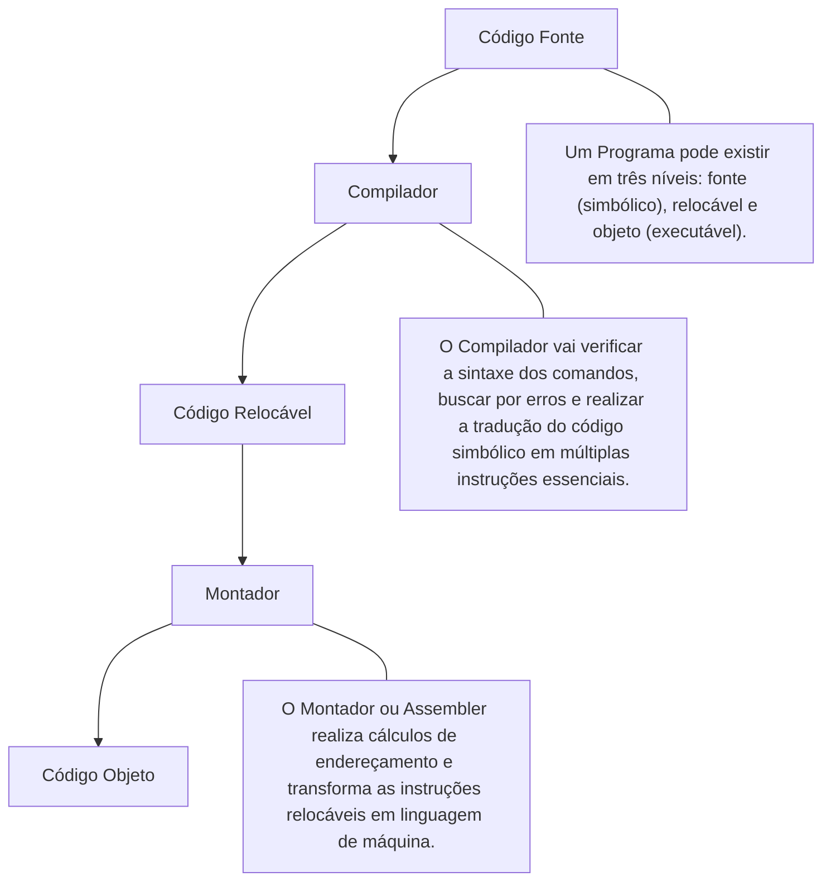
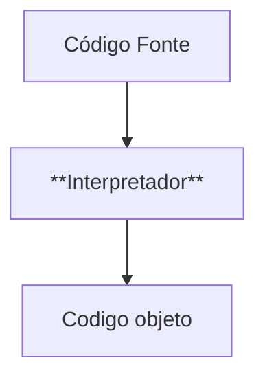

# Computa-o
basico



Para realização do código fonte ate o Objeto e utilizado um ``` Interpretador``` usado para simplificar 


<br>

## Resumo ✍️

|                  | Compilador                   | Interpretador              |
|------------------|------------------------------|-----------------------------|
| **Vantagem (+)** | + Usa menos memória em execução | + Tempo de resposta mais rápido (execução imediata) |
| **Desvantagem (-)** | - Tempo de processo maior (precisa compilar antes) | - Maior uso de memória em tempo de execução |


